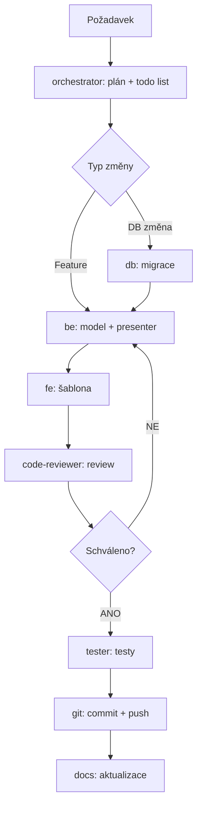

# Agenti — přehled a workflow

## Architektura agentů

Aplikace používá multi-agentní systém řízený orchestrátorem. Každý agent má specifickou odpovědnost.

```
orchestrator.agent.md
    ├── be.agent.md          (backend, modely, repozitáře)
    ├── fe.agent.md          (frontend, Latte šablony, CSS/JS)
    ├── db.agent.md          (DB schéma, migrace)
    ├── importer.agent.md    (import source.txt)
    ├── code-reviewer.agent.md
    ├── tester.agent.md
    ├── git.agent.md
    └── docs.agent.md
```

## Popis agentů

### orchestrator — `.copilot/orchestrator.agent.md`
- **Role**: Koordinátor celého workflow
- **Limit**: Max 150 řádků (záměrně stručný)
- **Kdy použít**: Při každém větším úkolu — rozhodne, který subagent povolat
- **Výstupy**: Plán v `manage_todo_list`, delegace na subagenty

### be — `.copilot/be.agent.md`
- **Role**: PHP backend — Nette modely, repozitáře, presentery, business logika
- **Patterns**: Repository pattern, constructor injection, strict_types, PSR-12
- **Kdy použít**: Nová funkce v modelu, oprava presenteru, validace dat

### fe — `.copilot/fe.agent.md`
- **Role**: Latte šablony, Bootstrap 5.3, Chart.js 4, CSS/JS
- **Patterns**: Nette `{$var|escapeHtml}`, inline Chart.js, filter panel
- **Kdy použít**: Nová stránka, úprava UI, oprava šablony

### db — `.copilot/db.agent.md`
- **Role**: DB schéma, SQL migrace, Nette Database konfigurace
- **Patterns**: Číslované migrace `00X_název.sql`, InnoDB, utf8mb4
- **Kdy použít**: Nová tabulka, nový sloupec, index optimalizace

### importer — `.copilot/importer.agent.md`
- **Role**: Import historických dat ze `source.txt`
- **Patterns**: Parsování datumu, normalizace typů, TEAM záznamy
- **Kdy použít**: Úprava import skriptu, nový formát vstupních dat

### code-reviewer — `.copilot/code-reviewer.agent.md`
- **Role**: Code review — bezpečnost, OWASP Top 10, PHP best practices
- **Kdy použít**: Před každým commitem na main, po dokončení funkce

### tester — `.copilot/tester.agent.md`
- **Role**: Testy — Nette Tester, unit testy repozitářů, integrace
- **Kdy použít**: Po implementaci nové funkce, při regresi

### git — `.copilot/git.agent.md`
- **Role**: Git operace — add, commit, push, branching, tagging
- **Kdy použít**: Commit změn, push na GitHub, release tag
- **GitHub**: `https://github.com/Tkrenek/punishmen_application`

### docs — `.copilot/docs.agent.md`
- **Role**: Dokumentace — `.docs/` soubory, README, komentáře v kódu
- **Kdy použít**: Aktualizace dokumentace po implementaci

## Workflow — nová funkce



## Commit konvence

| Prefix | Použití |
|---|---|
| `feat:` | nová funkce |
| `fix:` | oprava chyby |
| `db:` | databázová migrace |
| `docs:` | dokumentace |
| `refactor:` | refaktoring bez změny chování |
| `test:` | testy |
| `chore:` | infrastruktura, dependencies |
