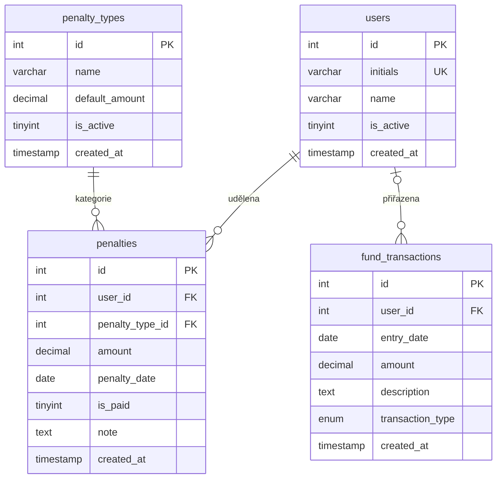

# Databázové schéma — Pokutovník

## ER Diagram



---

## Tabulka `users` — Uživatelé

Číselník uživatelů — členů týmu, kterým lze udělit pokutu.

| Sloupec | Typ | Nullable | Výchozí | Popis |
|---|---|---|---|---|
| id | INT UNSIGNED | NOT NULL | AUTO_INCREMENT | PK |
| initials | VARCHAR(10) | NOT NULL | — | Iniciály (TP, JU, ...) — unikátní |
| name | VARCHAR(100) | NULL | NULL | Celé jméno (volitelné) |
| is_active | TINYINT(1) | NOT NULL | 1 | Soft delete: 1=aktivní, 0=neaktivní |
| created_at | TIMESTAMP | NOT NULL | CURRENT_TIMESTAMP | Datum vytvoření |

**Indexy:** PRIMARY (id), UNIQUE (initials)

**Soft delete:** Deaktivovaný uživatel se nezobrazuje v selectu pro nové pokuty, ale historické pokuty zůstávají zachovány.

---

## Tabulka `penalty_types` — Typy pokut

Číselník kategorií pokut.

| Sloupec | Typ | Nullable | Výchozí | Popis |
|---|---|---|---|---|
| id | INT UNSIGNED | NOT NULL | AUTO_INCREMENT | PK |
| name | VARCHAR(200) | NOT NULL | — | Název typu pokuty |
| default_amount | DECIMAL(10,2) | NOT NULL | 20.00 | Výchozí výše pokuty v Kč |
| is_active | TINYINT(1) | NOT NULL | 1 | Soft delete |
| created_at | TIMESTAMP | NOT NULL | CURRENT_TIMESTAMP | Datum vytvoření |

**Aktuální typy pokut (produkce):**
| ID | Název | Počet pokut |
|---|---|---|
| 1 | chybějící výkazy vzhledem k docházce při kontrole | 287 |
| 3 | neaktualizovaná planning tabulka při kontrole | 195 |
| 5 | nepřeplánování úkolů pro česání do deadlinu | 1 |
| 6 | neomluvený pozdní příchod | 48 |
| 7 | nepřeplánovaný červený sloupec | 100 |

---

## Tabulka `penalties` — Pokuty

Hlavní tabulka se záznamy pokut.

| Sloupec | Typ | Nullable | Výchozí | Popis |
|---|---|---|---|---|
| id | INT UNSIGNED | NOT NULL | AUTO_INCREMENT | PK |
| user_id | INT UNSIGNED | NOT NULL | — | FK → users.id |
| penalty_type_id | INT UNSIGNED | NOT NULL | — | FK → penalty_types.id |
| amount | DECIMAL(10,2) | NOT NULL | 20.00 | Výše pokuty v Kč |
| penalty_date | DATE | NOT NULL | — | Datum udělení pokuty |
| is_paid | TINYINT(1) | NOT NULL | 0 | 0=nezaplaceno, 1=zaplaceno |
| note | TEXT | NULL | NULL | Poznámka (originální text z evidence) |
| created_at | TIMESTAMP | NOT NULL | CURRENT_TIMESTAMP | Datum záznamu |

**Indexy:**
- PRIMARY (id)
- idx_penalties_user_id (user_id)
- idx_penalties_date (penalty_date)
- idx_penalties_is_paid (is_paid)
- idx_penalties_type_id (penalty_type_id)

**FK constraints:**
- `fk_penalties_user`: `user_id` → `users.id`
- `fk_penalties_type`: `penalty_type_id` → `penalty_types.id`

---

## Tabulka `fund_transactions` — Fund transakce

Evidence finančních toků fondu pokut (výdaje a bonusy).

| Sloupec | Typ | Nullable | Výchozí | Popis |
|---|---|---|---|---|
| id | INT UNSIGNED | NOT NULL | AUTO_INCREMENT | PK |
| user_id | INT UNSIGNED | NULL | NULL | FK → users.id; NULL = kolektivní |
| entry_date | DATE | NOT NULL | — | Datum transakce |
| amount | DECIMAL(10,2) | NOT NULL | — | Částka v Kč (vždy kladná) |
| description | TEXT | NOT NULL | — | Popis transakce |
| transaction_type | ENUM | NOT NULL | — | `withdrawal` nebo `bonus` |
| created_at | TIMESTAMP | NOT NULL | CURRENT_TIMESTAMP | Datum záznamu |

**Indexy:**
- PRIMARY (id)
- idx_fund_date (entry_date)
- idx_fund_type (transaction_type)

**FK constraints:**
- `fk_fund_user`: `user_id` → `users.id` ON DELETE SET NULL

**Typy transakcí:**
- `withdrawal` — výdaj z fondu (snižuje zůstatek)
- `bonus` — příjem do fondu (zvyšuje zůstatek)

---

## Výpočet zůstatku fondu

```
Zůstatek = SUM(penalties.amount WHERE is_paid=1)
         + SUM(fund_transactions.amount WHERE transaction_type='bonus')
         - SUM(fund_transactions.amount WHERE transaction_type='withdrawal')
```

Implementace: `App\Model\StatisticsModel::getTotalBalance()`

---

## Databázová konfigurace

| Parametr | Hodnota |
|---|---|
| Engine | InnoDB |
| Charset | utf8mb4 |
| Collation | utf8mb4_unicode_ci |
| Prod DB | punishment_app |
| Test DB | punishment_app_test |
| Host | 127.0.0.1 |
| User | root |
| Password | (prázdné) |