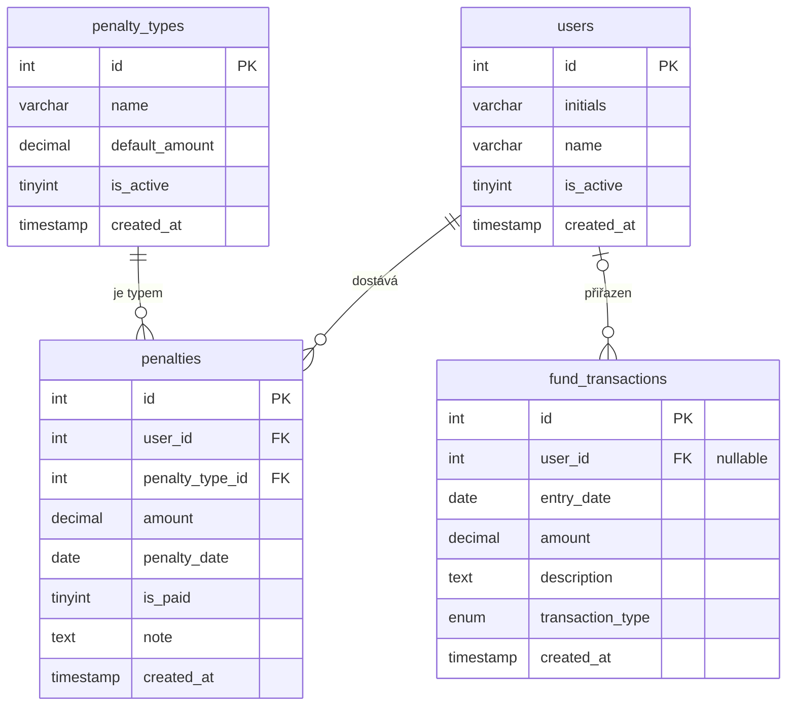

# Databázové schéma — Pokutovník

## ER Diagram



## Tabulky

### `users` — Číselník uživatelů
| Sloupec | Typ | Popis |
|---|---|---|
| id | INT UNSIGNED PK | Auto-increment |
| initials | VARCHAR(10) UNIQUE | Iniciály (TP, JU, PSP, ...) |
| name | VARCHAR(100) NULL | Celé jméno (volitelné) |
| is_active | TINYINT(1) | 1 = aktivní, 0 = soft delete |
| created_at | TIMESTAMP | Čas vytvoření záznamu |

### `penalty_types` — Číselník typů pokut
| Sloupec | Typ | Popis |
|---|---|---|
| id | INT UNSIGNED PK | Auto-increment |
| name | VARCHAR(200) | Název typu pokuty |
| default_amount | DECIMAL(10,2) | Výchozí výše v Kč (default 20.00) |
| is_active | TINYINT(1) | 1 = aktivní, 0 = deaktivován |
| created_at | TIMESTAMP | Čas vytvoření |

### `penalties` — Pokuty
| Sloupec | Typ | Popis |
|---|---|---|
| id | INT UNSIGNED PK | Auto-increment |
| user_id | INT UNSIGNED FK | Reference na `users.id` |
| penalty_type_id | INT UNSIGNED FK | Reference na `penalty_types.id` |
| amount | DECIMAL(10,2) | Výše pokuty v Kč |
| penalty_date | DATE | Datum udělení pokuty |
| is_paid | TINYINT(1) | 0 = nezaplaceno, 1 = zaplaceno |
| note | TEXT NULL | Originální poznámka |
| created_at | TIMESTAMP | Čas vytvoření záznamu |

**Indexy:** `user_id`, `penalty_date`, `is_paid`, `penalty_type_id`

### `fund_transactions` — Fond transakce
| Sloupec | Typ | Popis |
|---|---|---|
| id | INT UNSIGNED PK | Auto-increment |
| user_id | INT UNSIGNED NULL FK | Reference na uživatele (NULL = kolektivní) |
| entry_date | DATE | Datum transakce |
| amount | DECIMAL(10,2) | Částka v Kč (vždy kladná) |
| description | TEXT | Popis transakce |
| transaction_type | ENUM | `withdrawal` = výdaj, `bonus` = příjem |
| created_at | TIMESTAMP | Čas vytvoření záznamu |

## Seed data

### Uživatelé (iniciály ze source.txt)
TP, JU, PSP, PS, TCH, HK, TK, LM, MH, RN, ZM, RL, VD, PST

### Typy pokut
1. chybějící výkazy vzhledem k docházce při kontrole
2. nepřeplánovaný červený sloupec při kontrole
3. neaktualizovaná planning tabulka při kontrole
4. neomluvená absence *(sjednocení "neomluvená účast na daily" + "neomluvený pozdní příchod")*

## Zůstatek fondu — výpočet

```
Zůstatek = SUMA(penalties WHERE is_paid=1) + SUMA(fund_transactions WHERE type='bonus') - SUMA(fund_transactions WHERE type='withdrawal')
```
